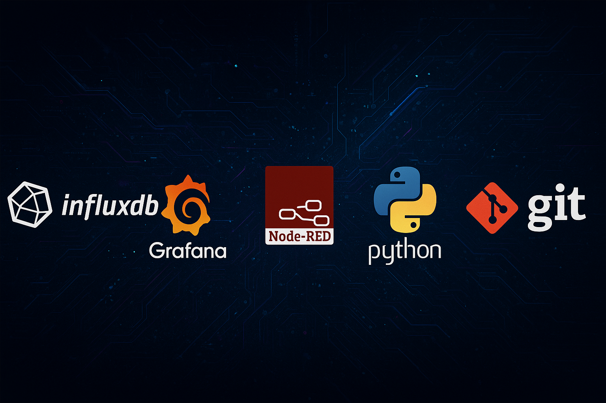

# 🎓 Educación

Mi formación combina áreas técnicas, científicas y tecnológicas, lo que me permite tener una visión integral de la automatización industrial, el diagnóstico por imagen y la inteligencia artificial.  
He enfocado mis estudios hacia la **aplicación de tecnologías avanzadas y el análisis de datos en entornos industriales y sanitarios**.

---

## Especialización en Inteligencia Artificial y Big Data  
**Centro:** C.F.SOMORROSTRO  
**Periodo:** 2025 – En curso   

---

## FP Superior en Automatización y Robótica Industrial  
**Centro:** C.F.Somorrostro  
**Periodo:** 2023 – 2025  

---

## Técnico Superior en Imagen para el Diagnóstico y Medicina Nuclear  
**Centro:** Escuela Quirón Salud  
**Periodo:** 2021 – 2023  
---

## Bachillerato Biosanitario  
**Centro:** C.F.SOMORROSTRO 

**Periodo:** 2018 – 2020
